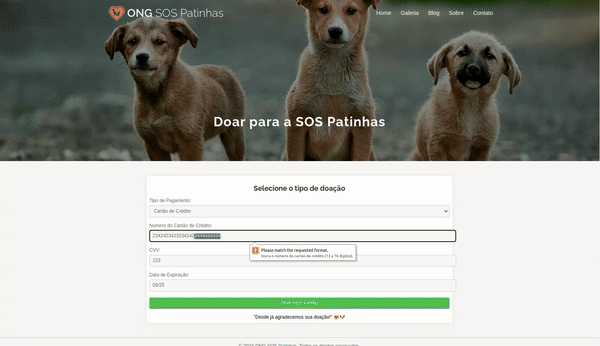

<a name="readme-top"></a>
<p align="center">
 <a href="#">
</p> 

<p align="center"> ONG SOS Patinhas</p>

<p align="center">
   <a href="#"></a>
</p>


[](https://miro.com/welcomeonboard/RWZ0RUhkRTV3cTRIbjVmUHBQWFc1SmZHendyYnJYcUxuVGEwYlUzN1pOVlp2YVVJM3dyYlRZVVlzSDVPMjg3Q3wzNDU4NzY0NTU2MjA1MjUxMzY0fDI=?share_link_id=623603983048)


- <a href="#intro">Introdução</a>
- <a href="#arq">Guia de Início Rápido</a>
- <a href="#meto">A metodologia</a>
- <a href="#demo">Demonstração do APP</a>
- <a href="#fluxo">Páginas</a>
- <a href="#col">Colaboradores</a>


## Introdução 🐶🐱
<a name="intro"></a>
A **ONG Patinhas** tem como missão mostrar animais para adoção e contribuir significativamente para a redução do número de animais abandonados. Além disso, busca promover a conscientização sobre a importância da adoção responsável, visando melhorar a qualidade de vida desses animais ao encontrar lares permanentes e amorosos para eles.

## Guia de Início Rápido 🐶🐱
<a name="arq"></a>

### 1. Baixar o Projeto do GitHub:
Você pode baixar o projeto clonando o repositório usando o Git no seu terminal ou baixando o arquivo ZIP.

- Clonando o Repositório:
```
$ git clone https://github.com/ong-patinhas/github.io.git
```

- Baixando o Arquivo ZIP:

Vá para a página do repositório no GitHub e clique em "Code" > "Download ZIP" para baixar o arquivo ZIP. Em seguida, descompacte o arquivo baixado.

### 2. Navegar até o Diretório do Projeto:
Após baixar o projeto, navegue até o diretório do projeto usando o terminal: 
 ```
 $ cd github.io
 ```

### 3. Executar o Projeto:
Em seu terminal, abra o projeto com o Visual Studio Code usando o comando abaixo:
```
$ code .
```
Abra a pasta html e clique com o botão direito na página index.html > Open with Live Server, abrindo o Live Server. (Obs: Você deve ter a extensão instalada na IDE).

## Metodologia 🐶🐱
<a name="meto"></a>


**1. Entendimento do problema:** Procuramos entender os requisitos do negócio e os objetivos a serem alcançados.

**2. Planejamento:** Dividimos o problema em partes menores e mais gerenciáveis. Isso ajudou a abordar cada etapa de forma mais eficaz.

**3. Escolha da metodologia de desenvolvimento:** Metodologias ágeis, usamos um quadro Kanban do Github projects, para lidar com organização e autogerenciamento.

**4. Implementação e Desenvolvimento:** A escolha das ferramentas adequadas para implementar a solução foi a mesma utilizada em todas as sprints: VSCODE, HTML, CSS e JS.

**5. Documentação:** A documentação consiste na escrita deste README mantendo registros detalhados do processo de desenvolvimento, incluindo decisões, problemas encontrados e soluções implementadas e também este [documento](https://docs.google.com/presentation/d/1Blm9irsOA6lQFmVob1__eKbQgSLWOzy52JFltvd1E60/edit?usp=sharing) utilizado durante as reuniões de planning.

**6. Comunicação:** Fizemos reuniões regulares para assegurar que a solução proposta atendesse às expectativas do negócio.

🧰 Ferramentas úteis:

- Controle de versão:  Git. Também utilizamos Gitflow durante o desenvolvimento.
- Ambientes de Desenvolvimento Integrado -(IDEs): Visual Studio Code.
- Plataformas de Gerenciamento de Projetos: - Github Projects.
- outros: Miro, Draw.io.

<p align="right">(<a href="#readme-top">Voltar ao topo</a>)</p>

## Demonstração da Aplicação 🐶🐱
<a name="demo"></a>

[Deploy no Github Pages](https://ong-patinhas.github.io/github.io/html/index.html)


----------------------------------------------------------------------------------------------
<p align="right">(<a href="#readme-top">Voltar ao topo</a>)</p>

## Páginas 🐶🐱
<a name="pages"></a>

Neste projeto foram desenvolvidas as páginas: Home, Blog, Sobre, Doações, Galeria e Contato.

Demonstração de algumas páginas:

<p align="center">
  <a href=""></a>
</p>

<p align="center"> Figura: Homepage</p>

<p align="center">
  <a href=""></a>
</p>

<p align="center"> Figura: Galeria de fotos</p>

<p align="center">
  <a href=""></a>
</p>

<p align="center"> Figura: Exemplo de formulário e validação</p>


## 🤝 Colaboradores
<a name="col"></a>
- [Michele Rodrigues](https://github.com/MicheleRodriguesc)
- [Fernanda Costa](https://github.com/fernandacostads)
- [Elton Peixoto](https://github.com/elton-peixoto-lu)
- [Dayane Morais](https://github.com/DayMorais)
- [Gustavo de Matos](https://github.com/658936gu)

## 😄 Seja um dos contribuidores!
Quer fazer parte desse projeto? Para contribuir, siga estas etapas:

1. Bifurque este repositório.
2. Crie um branch: git checkout -b <nome_branch>.
3. Faça suas alterações e confirme-as: git commit -m '<mensagem_commit>'
4. Envie para o branch original: git push origin <nome_do_projeto> / <local_>
5. Crie a solicitação de pull.

Como alternativa, consulte a documentação do GitHub em como criar uma solicitação pull.
Clique [AQUI](https://opensource.guide/how-to-contribute/) e leia como contribuir.


## 📝 Licença
Esse projeto está sob licença. Veja o arquivo [LICENÇA](https://github.com/ong-patinhas/github.io/blob/main/LICENSE) para mais detalhes.


<p align="right">(<a href="#readme-top">Voltar ao topo</a>)</p>
<hr>
<p align="center">Copyright © 2024 | ONG SOS Patinhas </p>