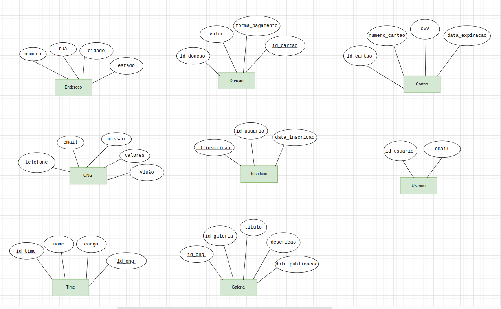
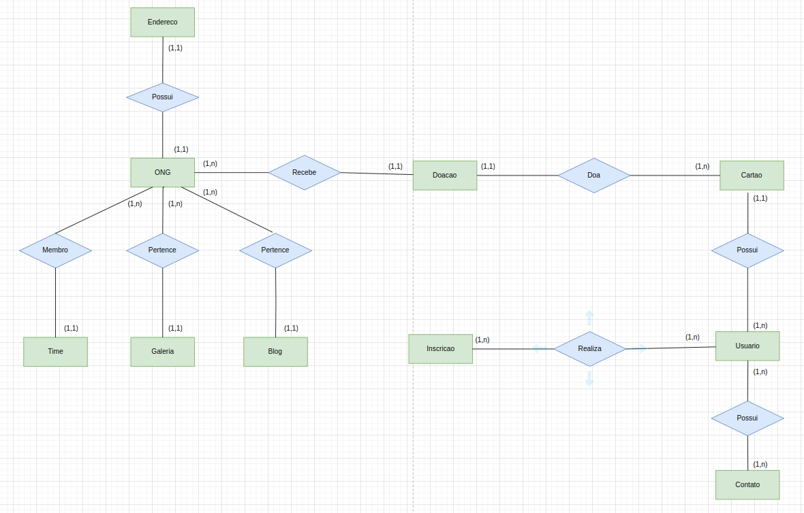

<a name="readme-top"></a>

<p align="center">
  <a href="#">
    
  </a>
</p>
&nbsp;

# Banco de Dados - ONG SOS Patinhas 
A entrega desta sprint é um protótipo de modelagem de dados desenvolvido como parte do projeto *ONG SOS Patinhas*.


##  Entidades
Aqui estão todos os atributos de cada entidade do sistema da ONG SOS Patinhas, conforme o diagrama de relacionamento entidade (DER):

<p align="center">
  <a href="#">
    
  </a>
</p>
<p align="center"> Figura 1: Entidades do diagrama 27/04/24</p>

## DER 
<p align="center">
  <a href="#">
    
  </a>
</p>
<p align="center"> Figura 2: Diagrama entidade relacionamento 27/04/24</p>


## 🧰 Ferramentas úteis:

- Controle de versão:  Git. Também utilizamos Gitflow durante o desenvolvimento.
- Ambientes de Desenvolvimento : Utilizamos o [SQL Online](https://sqliteonline.com/) e o Postgres.
- Plataformas de Gerenciamento de Projetos: - Github Projects.
- outros: Miro, Draw.io.

<p align="right">(<a href="#readme-top">Voltar ao topo</a>)</p>

## Comece por aqui:
Para 
Para criar o banco de dados e as tabelas no banco de dados Postgres, é necessário seguir algumas etapas. Você pode utilizar o SQL Online ou instalar localmente. Caso escolha a segunda opção e já tenha o postgres siga os passos:

### 1.Crie o banco

Abra um terminal ou console de comandos.
Conecte-se ao servidor Postgres com o comando:
```
psql -U seu_usuario
```
Crie o banco de dados com o comando:
```
CREATE DATABASE sos_patinhas;
```
Conecte-se ao banco criado:
```
\c sos_patinhas
```
### 2.Crie as tabelas

1. Tabela "Usuário"
Vamos começar criando a tabela "Usuário" para armazenar informações sobre usuários:
 ```
 CREATE TABLE Usuario (
    id_usuario SERIAL PRIMARY KEY,
    email VARCHAR(100) UNIQUE NOT NULL
);

Tabela "Cartão de Crédito"
A tabela "Cartão de Crédito" armazena as informações dos cartões usados para doações:
 ```
CREATE TABLE CartaoCredito (
    id_cartao SERIAL PRIMARY KEY,
    numero_cartao VARCHAR(16) NOT NULL,
    cvv VARCHAR(3) NOT NULL,
    data_expiracao DATE NOT NULL
);

Tabela "Doação"
A tabela "Doação" armazena informações sobre as doações e possui uma chave estrangeira para o cartão de crédito (se for essa a forma de pagamento):
  ```
 CREATE TABLE Doacao (
    id_doacao SERIAL PRIMARY KEY,
    valor DECIMAL(10, 2) NOT NULL,
    forma_pagamento VARCHAR(4) CHECK (forma_pagamento IN ('PIX', 'CARD')),
    id_cartao INT REFERENCES CartaoCredito(id_cartao)
);
 ```
 Tabela "Inscrição Notícias"
A tabela "Inscrição Notícias" armazena informações sobre as inscrições dos usuários para receber notícias da ONG:

  ```
 CREATE TABLE InscricaoNoticias (
    id_inscricao SERIAL PRIMARY KEY,
    id_usuario INT REFERENCES Usuario(id_usuario),
    data_inscricao TIMESTAMP DEFAULT CURRENT_TIMESTAMP
);
 ```
 Tabela "Contato"
A tabela "Contato" armazena informações sobre os contatos feitos com a ONG e possui uma chave estrangeira para o usuário:

```
CREATE TABLE Contato (
    id_contato SERIAL PRIMARY KEY,
    nome VARCHAR(100) NOT NULL,
    email VARCHAR(100) NOT NULL,
    mensagem TEXT NOT NULL,
    id_usuario INT REFERENCES Usuario(id_usuario)
);
```

Tabela "ONG"
A tabela "ONG" armazena as informações sobre a organização:
```
CREATE TABLE ONG (
    id_ong SERIAL PRIMARY KEY,
    endereco_rua VARCHAR(100) NOT NULL,
    endereco_numero VARCHAR(10) NOT NULL,
    endereco_cidade VARCHAR(50) NOT NULL,
    endereco_estado VARCHAR(20) NOT NULL,
    email VARCHAR(100) UNIQUE NOT NULL,
    telefone VARCHAR(15),
    visao TEXT,
    missao TEXT,
    valores TEXT
);
```

Tabela "Time"
A tabela "Time" armazena informações sobre os membros da equipe da ONG e possui uma chave estrangeira para a ONG:
```
CREATE TABLE Time (
    id_time SERIAL PRIMARY KEY,
    nome VARCHAR(100) NOT NULL,
    cargo VARCHAR(50) NOT NULL,
    id_ong INT REFERENCES ONG(id_ong)
);
```

Tabela "Blog"
A tabela "Blog" armazena informações sobre postagens do blog da ONG e possui uma chave estrangeira para a ONG:

```
CREATE TABLE Blog (
    id_blog SERIAL PRIMARY KEY,
    titulo VARCHAR(200) NOT NULL,
    conteudo TEXT NOT NULL,
    data_publicacao TIMESTAMP DEFAULT CURRENT_TIMESTAMP,
    id_ong INT REFERENCES ONG(id_ong)
);
```
Tabela "Galeria de Fotos"
A tabela "Galeria de Fotos" armazena informações sobre as fotos da galeria da ONG e possui uma chave estrangeira para a ONG:

```
CREATE TABLE GaleriaFotos (
    id_galeria SERIAL PRIMARY KEY,
    titulo VARCHAR(200) NOT NULL,
    descricao TEXT,
    data_publicacao TIMESTAMP DEFAULT CURRENT_TIMESTAMP,
    id_ong INT REFERENCES ONG(id_ong)
);
```
## Populando o banco

O seguinte comando foi utilizado para popular todas as tabelas:

```
INSERT INTO Usuario (email)
VALUES
    ('fernanda@gmail.com'),
    ('joao@gmail.com'),
    ('maria@gmail.com'),
    ('dani@gmail.com'),
    ('michelle@gmail.com'),
    ('mateus@gmail.com');
    
    
INSERT INTO CartaoCredito (numero_cartao, cvv, data_expiracao)
VALUES
    ('4111111111111111', '123', '2025-12-31'),
    ('5500000000000004', '456', '2024-06-30'),
    ('6011000000000004', '789', '2026-09-30'),
    ('4523523535235211', '123', '2025-12-31'),
    ('2345345352520004', '456', '2024-06-30');
  
 
INSERT INTO Doacao (id_usuario,valor, forma_pagamento, id_cartao)
VALUES
    (1, 150.00, 'CARD', 1),
    (2, 200.00, 'CARD', 2),
    (3, 300.00, 'PIX', NULL),
    (4, 450.00, 'CARD', 1),
    (5, 500.00, 'CARD', 2),
    (6, 300.00, 'PIX', NULL);


INSERT INTO InscricaoNoticias (id_usuario, data_inscricao)
VALUES
    (1, '2024-04-01 10:00:00'),
    (2, '2024-04-05 14:30:00'),
    (3, '2024-04-06 09:15:00'),
    (4, '2024-04-08 10:00:00'),
    (5, '2024-04-15 14:30:00');


INSERT INTO Contato (nome, email, mensagem, id_usuario)
VALUES
    ('João da Silva', 'joao@gmail.com', 'Gostaria de mais informações sobre a ONG.', 1),
    ('Maria Oliveira', 'maria@gmail.com', 'Gostaria de ajudar com doações.', 2),
    ('Carlos Souza', 'carlos@gmail.com', 'Tenho algumas sugestões para a ONG.', 3),
    ('Fernanda Sousa', 'joao@gmail.com', 'Gostaria de mais informações sobre a ONG.', 4),
    ('Marcos Cruz', 'marcoscruz@gmail.com', 'Gostaria de ajudar com doações.', 5);


INSERT INTO ONG (endereco_rua, endereco_numero, endereco_cidade, endereco_estado, email, telefone, visao, missao, valores)
VALUES
    ('Av. das Patinhas', '4', 'Fortaleza', 'CE', 'contato@sospatinhas.org', '1234-5678', 'Visão da ONG', 'Missão da ONG', 'Valores da ONG');


INSERT INTO Time (nome, cargo, id_ong)
VALUES
	('Daiany Morais', 'Processo de adoção', 1),
    ('Fernanda Costa', 'Cuidados veterinários', 1),
    ('Gustavo Silva', 'Resgate e controle de animais', 1),
    ('Michele Rodrigues', 'Rotina e adaptação', 1),
    ('Elton Peixoto', 'Staff', 1);


INSERT INTO Blog (titulo, conteudo, data_publicacao, id_ong)
VALUES
    ('Primeira Postagem', 'Conteúdo da primeira postagem do blog.', '2024-02-01 10:00:00', 1),
    ('Segunda Postagem', 'Conteúdo da segunda postagem do blog.', '2024-02-10 14:30:00', 1),
    ('Terceira Postagem', 'Conteúdo da 3 postagem do blog.', '2024-03-01 12:00:00', 1),
    ('Quarta Postagem', 'Conteúdo da 4 postagem do blog.', '2024-03-10 16:30:00', 1),
    ('Quinta Postagem', 'Conteúdo da 5 postagem do blog.', '2024-04-01 10:00:00', 1),
    ('Sexta Postagem', 'Conteúdo da 6 postagem do blog.', '2024-04-10 16:30:00', 1);


INSERT INTO GaleriaFotos (titulo, descricao, data_publicacao, id_ong)
VALUES
    ('Evento de Adoção', 'Fotos do evento de adoção.', '2024-04-15 09:15:00', 1),
    ('Visita ao Abrigo', 'Fotos da visita ao abrigo.', '2024-04-20 11:00:00', 1),
    ('Evento de Castração', 'Fotos do evento de castração.', '2024-04-20 11:00:00', 1),
    ('Evento de Vacinação', 'Fotos do evento de vacinação.', '2024-04-20 11:00:00', 1),
    ('Visita ao Abrigo', 'Fotos da visita ao abrigo.', '2024-04-20 11:00:00', 1);

```


## Consultas
Primeiro vamos começar com algumas consultas simples para extrair dados de tabelas individuais. Em seguida, faremos consultas usando joins para combinar dados de diferentes tabelas com base nos relacionamentos que foram definidos.

```
--Consultas Simples

--Selecionar todos os usuários:
SELECT * FROM Usuario;


--Selecionar todas as doações:
SELECT * FROM Doacao;


--Selecionar todas as inscrições em notícias:
SELECT * FROM InscricaoNoticias;


--Selecionar todos os contatos:
SELECT * FROM Contato;

SELECT * FROM Time;

--Consultas com Joins

--Obter todas as doações com informações sobre o cartão de crédito utilizado:
--Usamos um join entre as tabelas "Doacao" e "CartaoCredito" com base no id_cartao.
SELECT d.id_doacao, d.valor, d.forma_pagamento, c.numero_cartao, c.cvv, c.data_expiracao
FROM Doacao d
LEFT JOIN CartaoCredito c ON d.id_cartao = c.id_cartao
WHERE d.forma_pagamento = 'CARD';

--Obter todos os contatos feitos por um usuário específico:
--Usamos um join entre as tabelas "Contato" e "Usuario" com base no id_usuario.
SELECT c.id_contato, c.nome, c.email, c.mensagem, u.email AS usuario_email
FROM Contato c
JOIN Usuario u ON c.id_usuario = u.id_usuario
WHERE u.email = 'fernanda@gmail.com';

--Obter todas as inscrições em notícias de um usuário específico:
--Usamos um join entre as tabelas "InscricaoNoticias" e "Usuario" com base no id_usuario.
SELECT i.id_inscricao, i.data_inscricao, u.email AS usuario_email
FROM InscricaoNoticias i
JOIN Usuario u ON i.id_usuario = u.id_usuario
WHERE u.email = 'fernanda@gmail.com';

--Obter todas as postagens de blog relacionadas à ONG:
--Usamos um join entre as tabelas "Blog" e "ONG" com base no id_ong.
SELECT b.id_blog, b.titulo, b.conteudo, b.data_publicacao, o.endereco_cidade
FROM Blog b
JOIN ONG o ON b.id_ong = o.id_ong;

--Consulta Avançada
--Obter um resumo das doações feitas por usuários, incluindo o valor total doado por cada usuário,
--a quantidade total de doações realizadas e a forma de pagamento mais comum utilizada por cada usuário.
SELECT
    u.id_usuario,
    u.email AS usuario_email,
    SUM(d.valor) AS total_doado,
    COUNT(d.id_doacao) AS total_doacoes,
    MAX(d.forma_pagamento) AS forma_pagamento_mais_comum
FROM
    Doacao d
    JOIN Usuario u ON d.id_usuario = u.id_usuario
GROUP BY
    u.id_usuario, u.email
ORDER BY
    total_doado DESC;
```

OBS: Uma pequena alteração foi realizada para atender a um requisito, com o comando:

```
ALTER TABLE Doacao
ADD COLUMN id_usuario INT REFERENCES Usuario(id_usuario);
```

<p align="right">(<a href="#readme-top">Voltar ao topo</a>)</p>


<hr>
<p align="center">Copyright © 2024 | ONG SOS Patinhas</p>